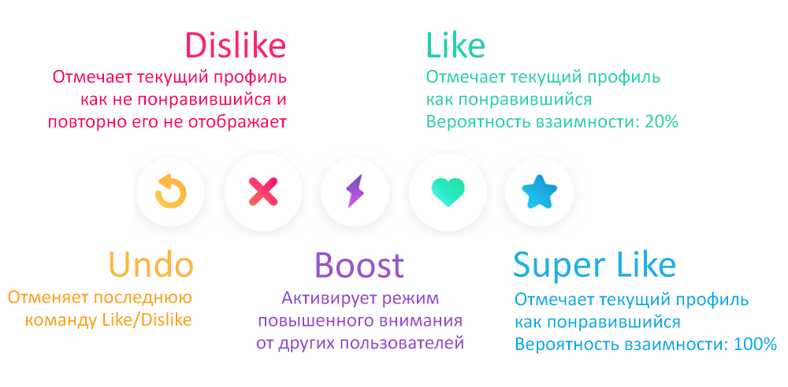

# Catinder

**Catinder** – это Tinder про котов, и для котов. Познакомьтесь с самым пушистым котом в округе, и договоритесь с ним о встрече, чтобы погладить его животик.

> Всё приложение на 100% выполнено в коде, без использования Storyboard’ов и XIB-файлов. Также не были использованы никакие сторонние библиотеки и/или зависимости.

&nbsp;
### Главный экран

Главный экран является сердцем приложения, все основные действия происходят именно здесь. Карточку понравившегося кота можно перетянуть направо, а не понравившегося – налево.

В случае, если карточка «утягивается» по горизонтали не достаточно далеко, то она возвращается назад с анимацией.

Указанные выше действия продублированы кнопками внизу. Помимо кнопок “Like” и “Dislike”, также имеются дополнительные кнопки.

Если карточка была ошибочно перемещена не в ту сторону, то пользователь имеет возможность отменить сколько угодно последних действий, вернуть любую карточку назад, и скорректировать своё решение.

&nbsp;
### Базовая карточка пользователя

Базовая карточка представлена на главном экране, и содержит в себе краткое описание, а также фотографии, которые можно пролистывать вперёд-назад, нажимая соответственно на правую или левую части карточки. Когда фотографии заканчиваются, карточка немного поворачивается в сторону нажатия, после чего тут же возвращается обратно, намекая на то, что является последней.

&nbsp;
### Расширенная карточка пользователя

После нажатия на кнопку дополнительной информации, открывается окно расширенной карточки пользователя, содержащее дополнительное описание.

Если у выбранного пользователя имеется больше одной фотографии, то на расширенной карточке появляется фотогалерея, которую можно пролистывать вправо-влево, и просматривать интересующие фотографии.

&nbsp;
### Совпадение

После нажатия на кнопку “Like” (или свайпа направо), программа эмулирует запрос к серверу, и возвращает информацию о «взаимности». Вероятность взаимного лайка определяется случайно, с вероятностью 20%. Нажатие на кнопку “Super Like” эмулирует 100% вероятности взаимного лайка.

Если лайк оказался взаимным, то появляется окно совпадения, предлагающее либо начать общаться с понравившимся котом, либо продолжить поиски.

&nbsp;
### Последние сообщения

...

&nbsp;
### Чат

...

&nbsp;
### Редактирование профиля

На странице редактирования профиля можно задать своё имя, возраст, краткое и подробное описание. При этом оба поля с описанием подстраиваются под размер содержимого, увеличиваясь, и уменьшаясь вместе с ним.

Также на этой странице можно загрузить фотографии с фотоаппарата, или выбрать из галереи, а неудачные фотографии можно удалить. 

Фотографии можно перетаскивать, ставя их на любое понравившееся место. Данная функциональность достигается за счёт использования нового класса `UICollectionViewCompositionalLayout` и делегатов `UICollectionViewDragDelegate` и `UICollectionViewDropDelegate`.

Порядок фотографий, заданный на данной странице будет соответствовать тому порядку, который увидит другой пользователь на карточке профиля данного пользователя. Первая фотография является главной.

&nbsp;
### Адаптивность

Приложение адаптируется под различные разрешения экранов. Пример работы приложения на iPhone SE:

Приложение поддерживает тёмную тему.

<png

&nbsp;
### Эмуляция сервера

Т.к. реального сервера для данного приложения не существует, то в качестве хранилища данных используется соседний репозиторий на GitHub. Данный репозиторий, ["Catinder Demo Server"](https://github.com/aleksey-paykachev/Catinder-Demo-Server) содержит фотографии, а также заранее подготовленные файлы в JSON-формате, со всеми профилями, взаимными «совпадениями», сообщениями, и т.п.

По причине отсутствия реального сервера, никакие изменения совершённые в программе (загрузка своих фотографий, отправка сообщений, и прочее) не сохраняются. По этой же причине, все HTTP запросы отличные от GET (POST, PUT, DELETE) были заменены на аналогичные, но упрощённые GET запросы.

API демонстрационного сервера описан в формате OpenAPI (Swagger), и развёрнут в упомянутом выше репозитории "Catinder Demo Server" как GitHub Pages: [Catinder OpenAPI (v 1.0)](https://aleksey-paykachev.github.io/Catinder-Demo-Server).
